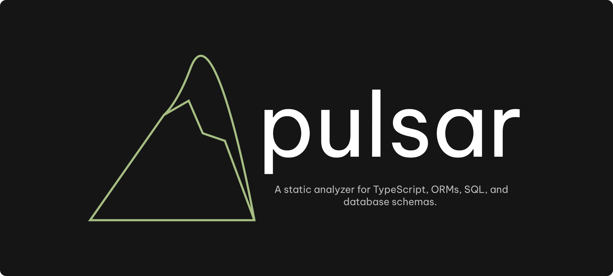

<p align="center">
  <picture>
    <source media="(prefers-color-scheme: dark)" srcset="./assets/banner.png">
    
  </picture>
</p>

<p align="center">
  <strong>A Rust-powered static analyzer for TypeScript ORM code.</strong>
  <br>
  Detects quality, performance, and consistency issues before they reach production.
</p>

<p align="center">
  <a href="https://github.com/CarlosEduJs/pulsar/actions/workflows/ci.yml"></a>
  <a href="https://github.com/CarlosEduJs/pulsar/releases"></a>
</p>

## Quick Start

```bash
# Requires Rust 1.80+
cargo build --release

# Analyze a file or project
cargo run -p pulsar-cli -- check src/queries.ts
cargo run -p pulsar-cli -- check .

# JSON output (for CI / tooling)
cargo run -p pulsar-cli -- check . --format json

# Generate a default config
cargo run -p pulsar-cli -- init
```

See the [Getting Started guide](https://https://pulsar-iota-inky.vercel.app/pulsar/docs/guide/getting-started) for a full walkthrough.

### Example

```
  src/users.ts:5:10  error    no-select-star     Avoid implicit SELECT *.
  src/users.ts:5:10  warning  no-missing-limit    Query is missing a LIMIT clause.

    const users = await db.select().from(users)
                       ^^^^^^^^^^^^^^^^^^^^^^^^

✖ 2 problems (1 error, 1 warning, 0 infos)
```

## Documentation

- [Guide](https://pulsar-iota-inky.vercel.app/docs/guide/) — getting started, CLI, configuration, CI integration
- [Rules](https://pulsar-iota-inky.vercel.app/docs/rules/) — all 12 built-in lint rules with examples
- [Tutorials](https://pulsar-iota-inky.vercel.app/docs/tutorials/) — setup, schema-aware analysis, CI/CD, fixing violations
- [Concepts](https://pulsar-iota-inky.vercel.app/docs/concepts/) — IR graph, schema-aware analysis internals

## Roadmap

| Area                    | Status |
|-------------------------|--------|
| TypeScript parsing      | ✅ Oxc frontend |
| SQL IR                  | ✅ sqlparser-rs frontend |
| Drizzle ORM             | ✅ Method chain resolution + loop/callback tracking |
| Raw SQL detection       | ✅ `sql\`…\`` tagged templates + `db.execute/all/get/run` |
| Rule engine             | ✅ 12 built-in rules |
| CLI (pretty/JSON)       | ✅ `pulsar-cli check`/`init`/`explain` |
| Config system           | ✅ `pulsar.toml` auto-detect + `--config` + `[database]` |
| Loop kind              | ✅ Counter vs Iteration distinction |
| Callback tracking       | ✅ `.then()`, `.map()`, `setTimeout`, etc. |
| Schema-aware rules      | ✅ Prisma frontend + 3 cross-layer rules |
| Prisma schema           | ✅ Parser for `.prisma` files |
| Property-based testing  | ✅ proptest (SQL, Prisma, Rules) |
| Fuzz testing            | ✅ cargo-fuzz (SQL, Prisma, Oxc, Combined) |
| Integration tests       | ✅ End-to-end pipeline via Rust API |
| Regression tests        | ✅ Edge cases + all fixtures |
| Test utilities          | ✅ `pulsar-test-utils` (builders, factories, fixtures) |

## Development

### Prerequisites

- Rust 1.80+
- [bun](https://bun.sh) (for the website)
- [cargo-fuzz](https://github.com/rust-fuzz/cargo-fuzz) + Nightly Rust (for fuzz testing)

### Commands

```bash
just build         # cargo build
just test          # cargo test --workspace
just clippy        # cargo clippy --workspace --all-targets -D warnings
just check         # fmt + clippy
just quick         # fmt + clippy + test (fast feedback)

# CLI
just run           # cargo run -p pulsar-cli -- check test/fixtures/
just run-rule      # Check a single rule fixture

# Fuzzing (requires nightly)
just fuzz          # Build all 4 fuzz targets
just fuzz-smoke    # 500 runs per target (quick sanity)
just fuzz-run      # Run a specific target indefinitely

# Smoke tests
just smoke         # Release build + CLI smoke tests
just smoke-schema  # Schema-aware CLI smoke tests

# CI pipeline
just ci            # fmt + clippy + test + release + smoke
```

### Website

```bash
just www-dev       # bun run dev
just www-build     # bun run build
just www-check     # bun run types:check
just www-lint      # bun run lint
just www-fmt       # bun run fmt
```

## Contributing

Contributions are welcome! Open an issue to discuss bugs or feature ideas. Before submitting a PR, make sure the following pass:

```bash
just check         # fmt + clippy (warnings as errors)
just test          # unit, integration, property-based, and regression tests
just fuzz          # fuzz targets compile (nightly)
just smoke         # CLI end-to-end tests
```

## License

MIT — see [LICENSE](LICENSE).
